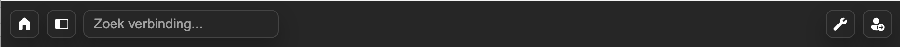

# KCM Toolbar Extension

A lightweight Keeper Connection Manager (KCM) / Apache Guacamole extension that adds a fixed top toolbar with:

- a Home button for the dashboard;
- a Menu button for the KCM/Guacamole menu; and
- a search field with connection results.

The toolbar is hidden on mobile devices and does not overlap the client viewport. It reduces the available height by a fixed 48 pixels.

## Features

- Fast local search across the connection tree.
- Navigation to the correct client URL using the Guacamole `ClientIdentifier`.
- Keyboard isolation while the search field is focused, preventing search input from being sent to the remote session.
- No credentials, connection content, or other sensitive data are stored by the extension.

## Security and privacy

This repository is intended to contain source code and generic deployment documentation only. Do not commit credentials, access tokens, private keys, customer data, connection details, screenshots containing personal information, or local machine paths. Use placeholders in examples and review the complete diff before publishing changes.

The extension uses the authenticated KCM/Guacamole session to retrieve the data required for its interface. It does not add a separate credential store.

## Toolbar overview



The toolbar provides:

- dashboard and menu shortcuts on the left;
- a central search field that searches the connection tree locally and can display group paths, active users, and session actions; and
- settings, sign-out, open-session tabs, reconnect/close actions, and status indicators on the right.

## Docker deployment

Define a shared volume called `kcm_extensions` and publish the extension from there:

```yaml
volumes:
  kcm_extensions:

services:
  guacamole:
    image: guacamole/guacamole:1.5.5
    volumes:
      - kcm_extensions:/extensions
```

1. Build the JAR locally (`msp-toolbar-extension/target/msp-toolbar-1.0.0.jar`).
2. Copy the JAR into the volume (for example, `docker run --rm -v kcm_extensions:/target -v "$(pwd)/msp-toolbar-extension/target":/source alpine sh -c "cp /source/msp-toolbar-1.0.0.jar /target/"`).
3. Rebuild or restart the Guacamole container so it loads the toolbar bundle at `/extensions/msp-toolbar-1.0.0.jar`.

## CI / builder container

If you prefer to build the extension from within a lightweight container, add a builder service that shares `kcm_extensions`, for example:

```yaml
kcm_toolbar_builder:
  image: alpine:latest
  container_name: kcm-toolbar-builder
  restart: "no"
  volumes:
    - "kcm_extensions:/out"
  command: >
    sh -c "
      set -e &&
      apk add --no-cache git zip &&
      rm -rf /tmp/src &&
      git clone https://github.com/AAD-Automatisering/kcm-toolbar.git /tmp/src &&
      cd /tmp/src/msp-toolbar-extension &&
      zip -r /out/msp-toolbar-extension.jar guac-manifest.json css/ js/ html/ &&
      echo 'Toolbar JAR ready'
    "
  networks:
    custom_net:
      ipv4_address: 172.18.0.10
```

Mount `kcm_extensions` so the builder drops `msp-toolbar-extension.jar` directly into the volume that Guacamole already reads. This keeps the artifact within Docker's volume namespace for CI/CD or installations without Maven.

## Development

- Run `mvn -q package` whenever you change `js/toolbar.js`, `css/toolbar.css`, or `guac-manifest.json` so the extension JAR bundles the latest frontend assets.
- The resulting `target/msp-toolbar-1.0.0.jar` contains `js/toolbar.js`, `css/toolbar.css`, and `guac-manifest.json`.
